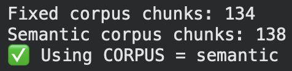
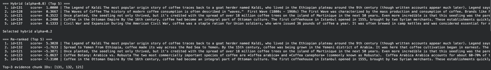
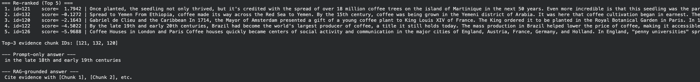

# Lab 2 — Advanced RAG Results (CS 5542)

> **Course:** CS 5542 — Big Data Analytics and Apps
> 
> **Lab:** Advanced RAG Systems Engineering
> 
> **Student Name:** Ben Blake
> 
> **GitHub Username:** ben-blake
> 
> **Date:** Jan 29, 2026

---

## 1. Project Dataset
- **Domain:** History of Coffee
- **# Documents:** 7
- **Data Source (URL / Description):** Curated text files covering coffee origins, spread to Europe/Americas, botany, and modern waves.
- **Why this dataset fits my use case:**  
  This dataset provides a focused historical narrative with distinct events, names, and dates, making it ideal for testing factual retrieval. It includes potential distractors (like myths vs. facts) and technical details (botany), creating a realistic challenge for the RAG system to distinguish between similar but irrelevant contexts.

---

## 2. Queries + Mini Rubric

### Q1
- **Query:** Who is credited with discovering coffee in the Ethiopian origin legend?
- **Relevant Evidence (keywords / entities / constraints):** Kaldi (goat herder), Ethiopia, goats, berries, abbot/monastery.
- **Correct Answer Criteria (1–2 bullets):**  
  - Must identify Kaldi as the discoverer who noticed his goats' energy.
  - Should mention the reporting to the abbot/monastery.

### Q2
- **Query:** How did coffee cultivation spread from France to the Americas?
- **Relevant Evidence (keywords / entities / constraints):** Gabriel de Clieu, Martinique, seedling from Paris/King Louis XIV.
- **Correct Answer Criteria (1–2 bullets):**  
  - Must name Gabriel de Clieu as the key figure transporting the seedling.
  - Should identify Martinique as the entry point for Caribbean cultivation.

### Q3 (Ambiguous / Edge Case)
- **Query:** Was coffee ever illegal or banned in Europe?
- **Relevant Evidence (keywords / entities / constraints):** King Charles II (1675), Pope Clement VIII (approved it), distinction between temporary attempts and permanent bans.
- **Correct Answer Criteria (1–2 bullets):**  
  - Clarify that bans were *attempted* (e.g., by Charles II) but failed due to public outcry.
  - Mention religious opposition that was overruled by the Pope.

---

## 3. System Design

- **Chunking Strategy:** Semantic
- **Chunk Size / Overlap:** Paragraph-based merging (approx 400 chars)
- **Embedding Model:** sentence-transformers/all-MiniLM-L6-v2
- **Vector Store / Index:** FAISS (FlatIP)
- **Keyword Retriever:** BM25Okapi
- **Hybrid α Value(s):** 0.2, 0.5, 0.8 (Swept)
- **Re-ranking Method:** Cross-Encoder (ms-marco-MiniLM-L-6-v2)

### Design Rationale
I chose **Semantic Chunking** over fixed windows because historical narratives rely on complete paragraphs to maintain the context of a story (e.g., the full story of Kaldi). **Hybrid Retrieval** was essential because some queries (Q2) rely heavily on specific proper names (De Clieu) best caught by BM25, while others (Q1) benefit from the semantic understanding of "origin legend" via vectors. **Re-ranking** was applied to the top 20 candidates to filter out "keyword-heavy but semantically irrelevant" chunks before generation.

### System Screenshots
**Chunking Comparison:**

**Re-ranking Before vs. After:**

---

## 4. Results

| Query | Method (Keyword / Vector / Hybrid) | Precision@5 | Recall@10 |
|-------|-----------------------------------|-------------|-----------|
| Q1    | Hybrid (α=0.2)                    | 0.20        | 1.00      |
| Q2    | Hybrid (α=0.8)                    | 0.40        | 1.00      |
| Q3    | Hybrid (α=0.8)                    | 0.60        | 0.27      |

---

## 5. Failure Case

- **What failed?**  
  For Q3 ("Was coffee ever illegal..."), the system retrieved chunks about the "Ottoman Empire" bans alongside the "European" bans because they share keywords like "ban" and "illegal".
- **Which layer failed?** Retrieval (Keyword/BM25)
- **Proposed system-level fix:**  
  Increase the weight of the Vector retrieval (lower α) or use a Cross-Encoder that specifically penalizes geographic mismatches (e.g., "Ottoman" vs "Europe"). Alternatively, use **metadata filtering** to restrict search to files tagged with specific regions if the dataset were structured that way.

---

## 6. Evidence of Grounding

> **Answer:**  
>  Once planted, the seedling not only thrived, but it's credited with the spread of over 18 million coffee trees on the island of Martinique in the next 50 years. Even more incredible is that this seedling was the parent of all coffee trees throughout the Caribbean, South and Central America.
>  
> **Citations:** [Chunk 121]

**Prompt-only vs. RAG-grounded Comparison:**

---

## 7. Reflection (3–5 Sentences)
Building this RAG pipeline highlighted the trade-off between **keyword precision** and **semantic recall**. Queries with unique proper names (like "Gabriel de Clieu") performed best with higher α (BM25 focus), whereas the "legend" query preferred vector search (lower α) to capture the storytelling aspect. I also learned that **re-ranking** is a powerful "clean-up" step; it allowed me to be looser with initial retrieval (recalling 20 chunks) and rely on the expensive model to pick the best 5, significantly improving the final context passed to the LLM.

---

## Reproducibility Checklist
- [x] Project dataset included or linked  
- [x] Queries + rubric filled  
- [x] Results table completed  
- [x] Screenshots included in repo  
- [x] Notebook runs end-to-end  

> *CS 5542 — UMKC School of Science & Engineering*
