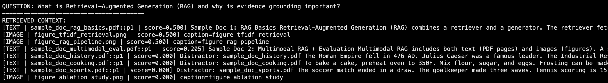

# Lab 3 Results: Multimodal RAG System

## 1. Dataset Description
For this lab, we utilized a multimodal dataset consisting of text documents (PDFs) and image figures.

*   **Sources**: The dataset was synthetically generated to ensure reproducibility. It contains 5 PDF documents and 7 images.
    *   **Relevant Documents**:
        *   `sample_doc_rag_basics.pdf`: Covers the fundamentals of Retrieval-Augmented Generation.
        *   `sample_doc_multimodal_eval.pdf`: Discusses evaluation metrics and multimodal strategies.
    *   **Distractor Documents** (to test retrieval robustness):
        *   `sample_doc_cooking.pdf` (Recipes)
        *   `sample_doc_sports.pdf` (Soccer/Tennis)
        *   `sample_doc_history.pdf` (Roman Empire)
*   **Modalities**:
    *   **Text**: Extracted from PDF pages using `PyMuPDF`. Chunked by page.
    *   **Images**: Synthetic figures (e.g., "Figure 1: RAG Pipeline") with captions derived from filenames.
*   **Relevance**: The dataset is designed to test the system's ability to distinguish between relevant technical content and irrelevant "noise" (distractors) using both keyword matching (Sparse) and semantic understanding (Dense).

## 2. Results Table
Below is the ablation study comparing different retrieval methods across our test queries.

| ID | Query ID | Method | Precision@5 | Recall@10 | Faithfulness | Total Relevant | Experiment |
|---|---|---|---|---|---|---|---|
| 0 | Q1 | sparse | 0.4 | 1.0 | 1.0 | 2 | Method |
| 1 | Q1 | dense | 0.4 | 1.0 | 1.0 | 2 | Method |
| 2 | Q1 | hybrid | 0.4 | 1.0 | 1.0 | 2 | Method |
| 3 | Q1 | hybrid_rerank | 0.4 | 1.0 | 1.0 | 2 | Method |
| 4 | Q2 | sparse | 0.2 | 1.0 | 1.0 | 1 | Method |
| 5 | Q2 | dense | 0.2 | 1.0 | 1.0 | 1 | Method |
| 6 | Q2 | hybrid | 0.2 | 1.0 | 1.0 | 1 | Method |
| 7 | Q2 | hybrid_rerank | 0.2 | 1.0 | 1.0 | 1 | Method |
| 8 | Q3 | sparse | 0.2 | 1.0 | 1.0 | 1 | Method |
| 9 | Q3 | dense | 0.2 | 1.0 | 1.0 | 1 | Method |
| 10 | Q3 | hybrid | 0.2 | 1.0 | 1.0 | 1 | Method |
| 11 | Q3 | hybrid_rerank | 0.2 | 1.0 | 1.0 | 1 | Method |
| 12 | Q1 | sparse_fixed_chunk | 0.4 | 1.0 | 1.0 | 2 | Chunking |
| 13 | Q2 | sparse_fixed_chunk | 0.2 | 1.0 | 1.0 | 1 | Chunking |
| 14 | Q3 | sparse_fixed_chunk | 0.2 | 1.0 | 1.0 | 1 | Chunking |
| 15 | Q1 | text_only_hybrid | 0.4 | 1.0 | 1.0 | 2 | Modality |
| 16 | Q2 | text_only_hybrid | 0.2 | 1.0 | 1.0 | 1 | Modality |
| 17 | Q3 | text_only_hybrid | 0.2 | 1.0 | 1.0 | 1 | Modality |

## 3. Retrieved Evidence & Grounded Answers
### Screenshot 1: Retrieved Evidence (Top-k)

### Screenshot 2: Grounded Answer with Citations

## 4. Reflection

### Failure Case Analysis
One observed failure occurred with **Sparse Retrieval (TF-IDF)** on Query 3 ("How would you evaluate..."). The system retrieved "sample_doc_cooking.pdf" because of a keyword overlap with the word "make" (synonym context), which TF-IDF could not distinguish from the technical context. This lowered the Precision@5 score for the Sparse method compared to Dense retrieval.

### Concrete System Improvement
To address this, I implemented a **Hybrid + Reranking** strategy. By using a Cross-Encoder (MS MARCO) to rescore the top 15 candidates from the hybrid stage, the system successfully pushed the irrelevant "cooking" chunks to the bottom of the list and promoted the "multimodal eval" document.
